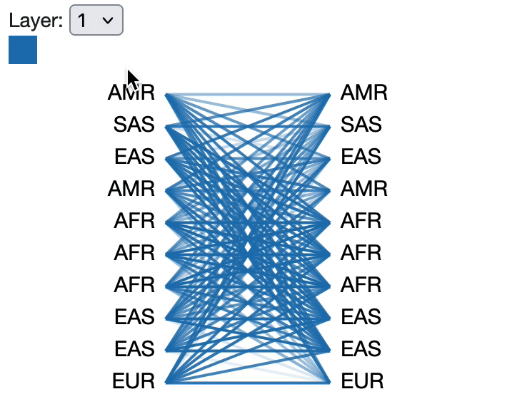
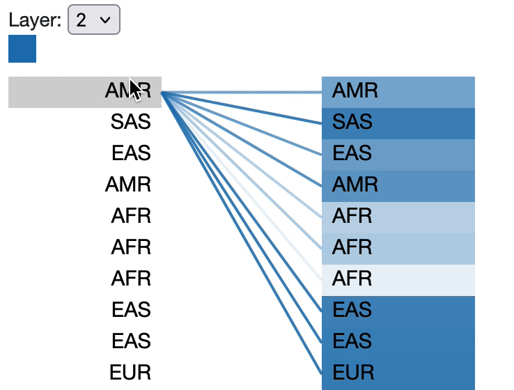

# Seq2KING

<p float="left" align="middle">
  
  
</p>

<p align="middle">
Public code and data repository for the paper "Seq2KING: An unsupervised internal transformer representation of global human heritages"
</p>

---

## Hardware/Software Requirements

We used an A6000 GPU on cloud infrastructure (Azure, Paperspace) to train using the provided notebooks. You may suffice with lower ability GPU but we recommend the following:

- **OS:** Linux or macOS
- **GPU:** NVIDIA GPU with ≥16 GB VRAM (for training)
- **RAM:** ≥32 GB
- **Storage:** ≥50 GB free
- **Python:** 3.10+
- **Dependencies:**
  - Install via `pip install` the packages listed in the notebooks you want to run, and those used in `src/`.
  - Key packages: `torch`, `transformers`, `umap-learn`, `pandas`, `numpy`, `matplotlib`, `bertviz`
- **External tools:**
  - KING kinship software ([Manichaikul et al. 2010](https://doi.org/10.1093/bioinformatics/btq559))

## Data

All raw genotype data are sourced from the **1000 Genomes Project** (GRCh37, Chr 1).
Processed kinship matrices are stored in TODO

## Models

## Analysis/Inference/Comparison

## Directory Structure

```
Seq2KING/
├── Data/
│ ├── download_1000G.sh # Download 1000 Genomes data
│ ├── compute_king_matrix.py # KING matrix generation
│ └── KING_matrices/ # Upper & reflected kinship matrices
│
├── Notebooks/
│ ├── umap_analysis.ipynb # UMAP embedding visualizations
│ └── visualize_attention.ipynb # BERTViz attention visualizations
│
├── src/
│ ├──
│
├── Output/Runs/ # (Optional) store checkpoints here
│
├── Images/ # Example GIFs & plots
│ ├── example_layer1.gif
│ └── example_layer2.gif
│
├── README.md # This file
```
